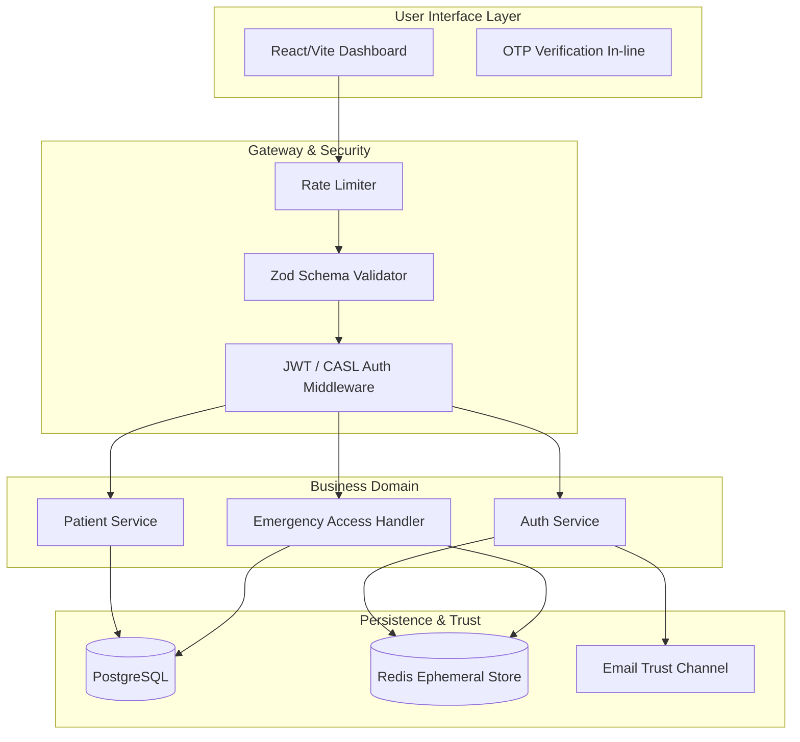
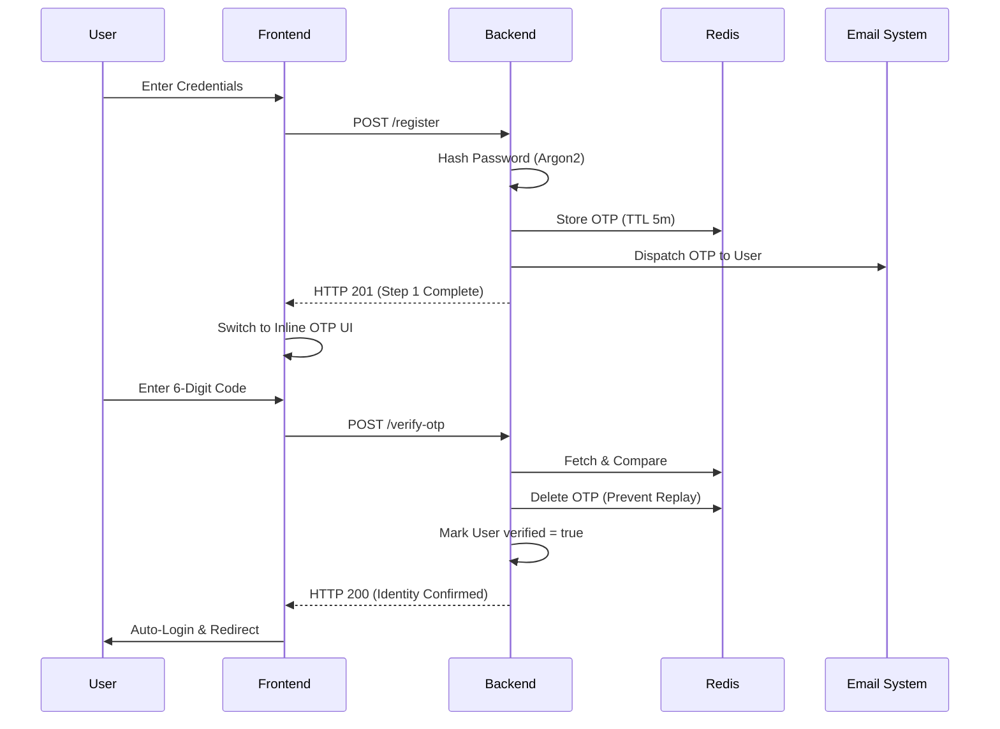
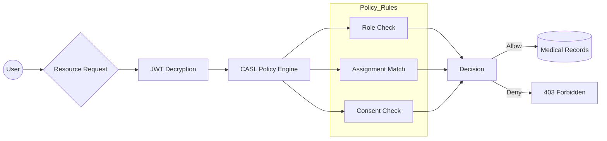
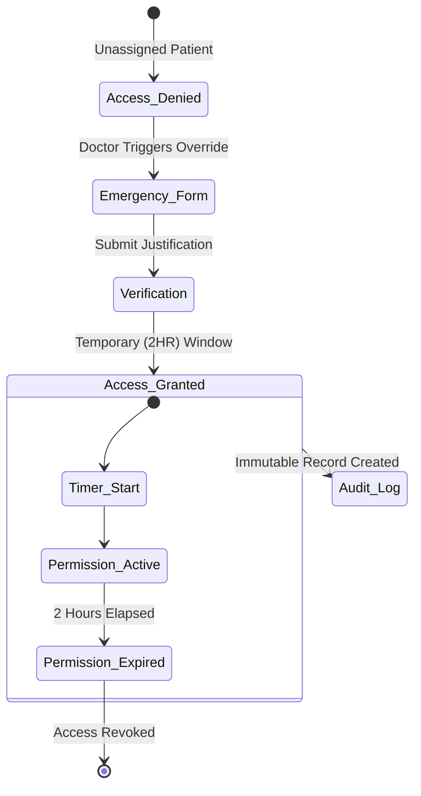

# 🛡️ MedAuth: Zero-Trust Healthcare Access Platform

Protecting sensitive medical data through strict authentication, ephemeral keys, and immutable audit trails.

---

## 🛑 The Problem: Healthcare Data Security

Modern healthcare systems suffer from **Premature Trust**. Standard applications grant wide-ranging access based on static, easily compromised passwords. When emergencies occur, rigid security protocols either lock providers out of critical patient data or, conversely, over-provision access, leading to catastrophic data breaches and HIPAA violations.

## 💡 The Solution: MedAuth

**MedAuth** is a production-grade, full-stack healthcare security platform engineered around **Zero-Trust Principles**. 

We replace static trust with dynamic, verifiable communication channels and time-bound ephemeral access. MedAuth proves identity through multi-step trust onboarding, executes authorizations via granular **ABAC (Attribute-Based Access Control)**, and provides a secure **"Break-Glass"** override for medical emergencies—ensuring privacy and availability coexist.

---

## 🏗️ System Architecture

MedAuth utilizes a decoupled client-server architecture, prioritizing separation of concerns and defense-in-depth.

### � High-Level Component Flow


---

## 🔒 Security Operations & Workflows

### 1. The Multi-Step Trust Onboarding (Inline Verification)
Verification is not an afterthought; it is the gateway. MedAuth enforces a synchronous OTP verification flow during registration to ensure every active account is backed by a verified communication channel.



### 2. Authorization Logic: CASL ABAC & RBAC
MedAuth doesn't just check roles; it checks **Attributes**.
*   **RBAC**: "Is this a Doctor?"
*   **ABAC**: "Is this Doctor assigned to this specific Patient?"



### 3. Emergency Break-Glass Workflow
In critical care, seconds count. MedAuth allows authorized staff to bypass standard assignment boundaries through a strictly audited "Break-Glass" mechanism.



---

## 🛠️ Technology Stack & Justifications

| Layer | Technology | Rationale |
| :--- | :--- | :--- |
| **Backend** | **Node.js / Express** | High concurrency for real-time telemetry. |
| **Type Safety** | **TypeScript** | Eliminates runtime authorization type errors. |
| **ORM** | **Prisma** | Deterministic, type-safe database access layer. |
| **Hashing** | **Argon2** | Industry-standard protection against GPU cracking. |
| **Validation** | **Zod** | Enforces data contract before logic execution. |
| **Cache** | **Redis** | Millisecond-level TTL enforcement for ephemeral secrets. |
| **Frontend** | **React 19 (Vite)** | Atomic component structure with instant HMR. |
| **Styling** | **Tailwind CSS** | Design system token adherence with no runtime CSS cost. |

---

## 📂 Project Structure
```text
/healthcare-auth-system
├── /backend
│   ├── /prisma           # DB schema & Seed (deterministic data)
│   ├── /src
│   │   ├── /modules      # Domain Logic (Auth, Emergency, Audit)
│   │   ├── /policies     # CASL ABAC Definitions
│   │   ├── /services     # Redis & SMTP Handlers
│   │   └── /middleware   # The Security Perimeter (JWT, Audit, Zod)
├── /frontend
│   ├── /src
│   │   ├── /pages        # Onboarding Portal & Dashboard
│   │   ├── /store        # Zustand Security Store
│   │   └── /services     # Axios Security Interceptors
```

---

## 🚀 Installation & Local Development

### 1. Backend Setup
```bash
cd backend
npm install
cp .env.example .env # Configure DB, Redis, and SMTP
npx prisma db seed # Primes DB with Admin/Staff accounts
npm run dev
```

### 2. Frontend Setup
```bash
cd ../frontend
npm install
npm run dev # Runs on locked port 5173
```

---

## 🎯 The Pitch Scenario
1.  **Strict Onboarding**: Register an account. Observe the **Inline OTP** verification—no verification, no access.
2.  **Boundaries**: Log in as a Doctor. Attempt to view an unassigned patient (Blocked by ABAC).
3.  **Emergency**: Trigger **Break-Glass** with a justification. Gain instant, time-bound access.
4.  **Accountability**: Switch to Admin. View the **Audit logs** to see the immutable trail of the emergency bypass.

---

## 📄 License
Licensed under the MIT License. Built for the Hackathon Stage-2 Submission.
